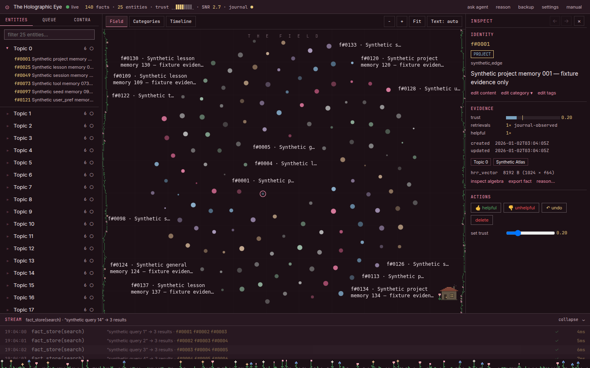

# ⊙ The Holographic Eye



*Screenshot uses synthetic demonstration data, not personal memories.*

A local glass cockpit for Hermes holographic memory. Explore the real HRR geometry,
follow recalled facts, inspect evidence, curate trust, and review journaled changes.
The desktop shell uses Rust and Tauri. The Field uses TypeScript and a small Zig/WebAssembly
hit-testing kernel. The provider stays outside Hermes core.

## The cockpit

- **Field:** real PCA coordinates, pan, zoom, selection, entity highlights, and a trust lens. Readable content snippets appear when space permits; Text can turn them off.
- **Categories and Timeline:** browse loaded facts by exact category or stored/updated UTC metadata, with local filters and bounded pages. Unknown dates remain explicit.
- **Narrow windows:** switch between Explore, Evidence, and Inspect without losing selection. Dialog headers and close controls stay visible.
- **Evidence bench:** Entities, Queue, and Contradictions. Open the next layer without losing the Field.
- **Inspect:** fact anatomy, 50-step back/forward history, edit previews, trust controls, and typed-ID deletion.
- **Stream:** a compact latest-event glance, expandable journal, and direct navigation to returned facts.
- **Workbench:** preview the provider's recall and inspect its actual vector spectra.
- **Appearance:** ten palette rows, Blossom Dark by default, four text sizes, and an optional pixel garden.
- **Recovery:** explicit connection retry, guarded submissions, conditional undo, and SQLite backups.

The Field's Zig kernel changes hit testing, not the stored vectors or PCA.
If WebAssembly cannot load, the same JavaScript selection algorithm remains available.
Settings reports the active geometry engine.

[Categories at 640×480](docs/categories-narrow.png) · [Timeline at 640×480](docs/timeline-narrow.png)

These screenshots use synthetic facts at 125% text scale. Timeline dates describe stored metadata, not event history.

## Install

The DEB/RPM installs the native shell. The provider and served interface are a separate,
user-level installation inside Hermes. Version 1.2 updates the shell and frontend; the provider/API remains 1.1.0. Existing 1.1 installations do not need a gateway restart.

### Desktop package

```bash
# Debian / Ubuntu / Mint
sudo apt install ./holographic-eye_1.2.0_amd64.deb

# Fedora / RHEL
sudo dnf install ./holographic-eye-1.2.0-1.x86_64.rpm

# Verify the installed shell
holographic-eye version --json
holographic-eye status --json
```

Linux Mint is the tested host. RPM payload validation does not prove a Fedora runtime install.
The package also installs the desktop entry, icons, and `man holographic-eye`.

### Existing 1.1 installation: frontend-only update

Save any Eye drafts and close its window, not Hermes. Build the frontend from this source tree as shown below. Back up the current assets, then copy only the new frontend:

```bash
front="$HOME/.hermes/plugins/holographic-eye/frontend"
backup="$HOME/.hermes/.eye-frontend-before-1.2-$(date +%Y%m%d-%H%M%S)"
cp -a "$front" "$backup"
rsync -a --delete build/eye_frontend/dist/ "$front/"
```

Reopen Eye. Keep the backup until verified. This does not update provider code, memory databases, or the gateway process.

### First installation: provider and interface

Requires the Hermes holographic provider, NumPy, and a working Hermes gateway.
The optional `threadpoolctl` package limits projection BLAS work to two threads during the SVD.
Without it, the same SVD remains available without that performance cap.

```bash
git clone https://github.com/RamenFast/holographic-eye.git
cd holographic-eye
npm --prefix build/eye_frontend ci
# Install the pinned Zig toolchain as described below, then:
npm --prefix build/eye_frontend run build
./build/deploy.sh
```

Select `memory.provider: holographic-eye` in Hermes configuration.
Provider code changes require an idle gateway restart. Do not interrupt active conversations.
Frontend-only changes do not require a restart. The deployment helper preserves unmanaged plugin files.
The control plane binds to `127.0.0.1:8770` and uses `~/.hermes/eye_token`.

### Build the Zig kernel and packages

The compiler stays inside the project, not in the release assets.

```bash
mkdir -p build/toolchains
curl --fail --location -o build/toolchains/zig-0.15.2.tar.xz \
  https://ziglang.org/download/0.15.2/zig-x86_64-linux-0.15.2.tar.xz
printf '%s  %s\n' \
  02aa270f183da276e5b5920b1dac44a63f1a49e55050ebde3aecc9eb82f93239 \
  build/toolchains/zig-0.15.2.tar.xz | sha256sum -c -
tar -xJf build/toolchains/zig-0.15.2.tar.xz -C build/toolchains
npm --prefix build/eye_frontend run build
cd build/eye_shell/src-tauri
cargo tauri build --bundles deb,rpm
```

The native build requires Rust, Tauri CLI 2, GTK3, WebKitGTK 4.1, and their development packages.
Set `ZIG` to an existing Zig **0.15.2** executable to use another compiler location.
Release assets include DEB, RPM, source tarball, and `SHA256SUMS`.

## Daily use

Launch `holographic-eye` from the desktop menu or terminal.
Use `Ctrl+F` to find a fact, `Ctrl+R` for the Reason Workbench, and `?` for the manual.
Inspect's Back/Forward buttons retrace single and multi-selections.
Active entity and trust contexts can be cleared independently.

The Hermes extension remains available:
`hermes holographic-eye status|tail|undo-last|backup|gui`, plus `/holo` in chat.

## Agent interface

`holographic-eye schema` describes the native CLI.
One-shot commands emit text on a terminal and one JSON object in a pipe.
Use `--json` to force structured output. Errors include a fix.
`status` checks the attached control plane and token-file readability; it does not authenticate the token.

The existing token-authenticated loopback API serves `/stats`, `/rpc`, and `/events`.
Read methods delegate to the provider's own implementation. The GUI does not implement another retrieval engine.
See [the interface reference](docs/AGENT-INTERFACE.md).

## Memory safety and limits

Tests use synthetic stores or isolated SQLite backup copies. Never run mutation tests against live memory.
Eye edits require an available journal. Undo rejects an event when affected state has changed since that event.
Entity operations retain affected fact images, including supported register state.
Unknown network outcomes are not silently retried; check the journal before sending the action again.

A shared operation lock serializes wrapper mutations **within one process**.
It does not stop another process from writing. Memory and journal are separate SQLite files,
so a crash or I/O failure between their commits can still leave an unjournaled change.
Agent writes retain best-effort journaling rather than blocking the agent when the journal fails.

Backups use SQLite's backup API. Their manifest counts come from the snapshot files.
A running backup has an in-process boundary, not a cross-process guarantee.
For a guaranteed quiescent pair, stop every writer during a maintenance window.
Restore is cold-only. Preserve the current databases and WAL/SHM sidecars first;
never copy a backup over a live WAL database or discard newer valid memory during a code rollback.

## Verification

```bash
npm --prefix build/eye_frontend run check
npm --prefix build/verify ci
node build/verify/gui_edge.cjs
node build/verify/test_responsive_views.cjs
node build/verify/test_explorer_data.cjs
node build/verify/test_field_labels.cjs
node build/verify/perf_frontend.cjs
# Longer warmed, alternating-order component comparison:
EYE_PERF_LONG=1 node build/verify/perf_frontend.cjs
node build/eye_geometry/test.mjs
```

Provider checks use Hermes' supported interpreter:
`build/verify/test_backend_edges.py`, `p1_equivalence.py`, `p2_control.py`, and `test_bootwarm.py`.
Inspect each harness before running it against a different installation.
Synthetic browser benchmarks are not native WebKitGTK performance claims.

## Honest ledger

- Quarantine mode and UMAP remain deliberately unbuilt.
- Retrieval counts are journal-observed, not upstream lifetime counts.
- Live restore is not supported.
- The desktop shell and the user-level provider are separate installation steps.
- Cross-process and cross-database crash atomicity are not claimed.
- A missing Zig compiler blocks a source build. A missing or unsupported WASM runtime uses the tested JavaScript fallback.

## Source and license

`PLAN.md` contains the vision, contracts, and decisions. `build/` contains their implementation.
`HANDOFF.md` records the installed/release state. Verification receipts and feedback live in `docs/dev/`.

[GPLv3](LICENSE). Fonts are system-resolved. The scope-drawn icon uses
[Phosphor](https://github.com/RamenFast).

*Built with Ben. Original implementation: Claude (Fable 5). This refinement: Prime and GPT workers.*
