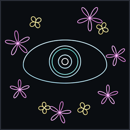
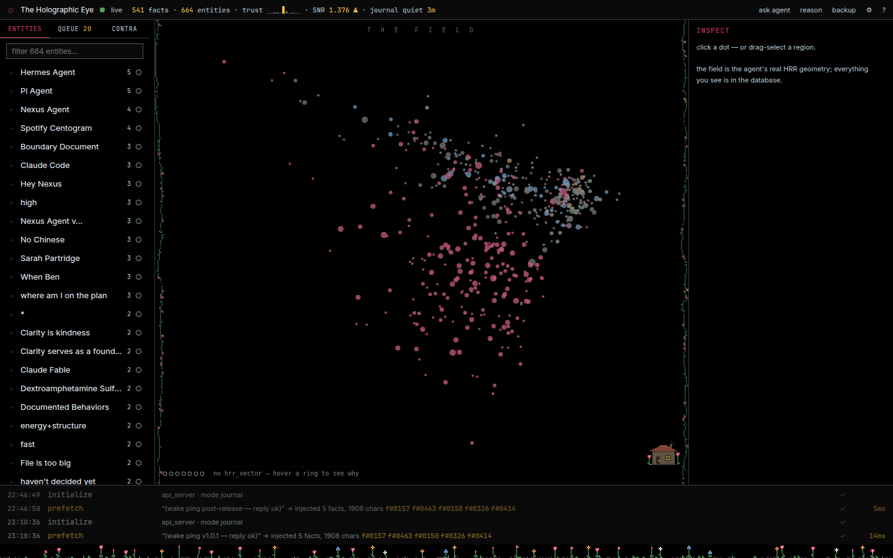
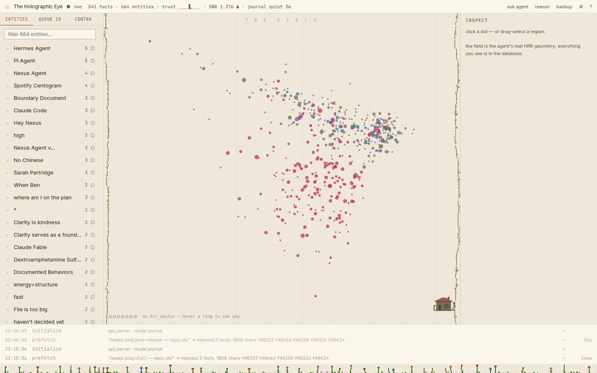
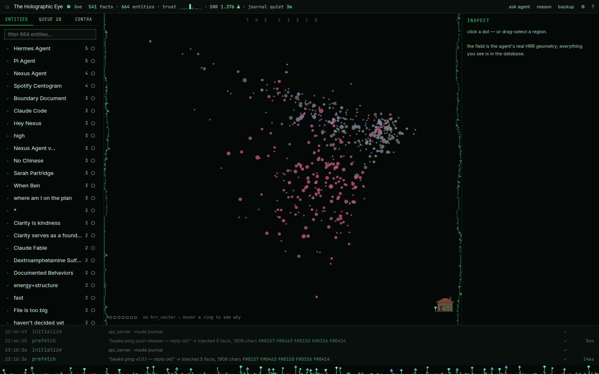

# ⊙ The Holographic Eye



Glass cockpit for the Hermes `holographic` memory provider — watch the
agent's memory live as its **real HRR geometry**, curate trust,
review/undo every write, merge junk entities, back it all up, and ask
the agent itself to revise its memory. Zero Hermes core changes.


Every dot is a stored fact placed by PCA of its actual 1024-dim phase
vector. Hue = category, vividness = trust, size = observed recalls.
The stream at the foot is the journal, live. The flowers are flowers.

## v1.0.0 — what changed

| | before | v1.0.0 |
|---|---|---|
| entity probe / workbench | ~4 s per click | **~40 ms** (runtime encoder memoization; results byte-identical, re-proven by the equivalence harness) |
| chrome | one hardcoded true-black theme | **10 palette rows** (sysmon/Phosphor token system) — Blossom Dark default, the old look preserved as *Blossom AMOLED* |
| pixel garden | tiled (symmetrical), overlaid the stream + scrollbars | grown by seeded RNG in its **own layout lane** + behind the Field — can never cover UI |
| app icon | static SVG rings | **drawn by the Phosphor engine**: parametric WAVs traced by the CRT beam, snapshotted per color layer |
| packaging | `.deb` only | `.deb` + `.rpm` + source tarball + SHA256SUMS, every release |
| port hygiene | a lingering CLI could steal :8770 | control plane binds only inside `hermes gateway run`; failed binds retry |

## Prerequisites (the Eye watches a living gateway)

1. [Hermes](https://github.com/hermes-agent) install with the bundled
   `holographic` memory provider working (numpy in the venv).
2. The wrapper provider deployed and selected — see *Install the
   provider* below.
3. The gateway **booted** (`hermes gateway start`). The control plane
   at `127.0.0.1:8770` wakes lazily on the first agent message.

## Install

### 1 · the provider (into the gateway)

```bash
git clone https://github.com/RamenFast/holographic-eye.git
cd holographic-eye
./build/deploy.sh                      # → ~/.hermes/plugins/holographic-eye
# config.yaml:  memory.provider: holographic-eye
hermes gateway restart
```

### 2 · the desktop app (from the release assets)

```bash
# Debian / Ubuntu / Mint — or just double-click the .deb
sudo apt install ./holographic-eye_1.0.0_amd64.deb

# Fedora / RHEL
sudo dnf install ./holographic-eye-1.0.0-1.x86_64.rpm

# verify
holographic-eye --version              # → holographic-eye 1.0.0
curl -s http://127.0.0.1:8770/health   # → {"ok": true, ... "version": "1.0.0"}
```

Built and installed on Linux Mint 22; the `.rpm` is `rpm --test`
verified there — Fedora reports welcome.

### from source (no packages)

```bash
cd build/eye_frontend && npm install && npm run build && cd ../..
./build/deploy.sh                                   # provider + GUI + /holo
cd build/eye_shell/src-tauri && cargo tauri build --bundles deb,rpm
```

## Daily use

| Surface | How |
|---|---|
| **GUI** | the desktop app, or `hermes holographic-eye gui` (tokened URL, any browser) |
| **CLI** | `hermes holographic-eye status \| tail \| undo-last \| backup \| gui` |
| **In chat** | `/holo [n]` — status + last n journal events |

Inside the GUI: the **Field** (pan/zoom/select the real geometry),
**Entities/Queue/Contra** tabs (probe, disclose, undo, contradiction
triage), **Inspect** (edit with server-computed preview, typed-ID
delete, trust slider), **Reason Workbench** (`⌘R` — previews *the
recall, not the answer*), FFT inspector, Backup Memory, ask-the-agent.
`?` is the manual; `⚙` holds the real settings — **theme** (10 rooms),
text size, pixel garden, projection refit, token reset.

## For agents

Everything the GUI does rides one loopback API — token in
`~/.hermes/eye_token`:

```bash
TOKEN=$(cat ~/.hermes/eye_token)
curl -s http://127.0.0.1:8770/health                       # no auth
curl -s -H "Authorization: Bearer $TOKEN" http://127.0.0.1:8770/stats
curl -s -X POST http://127.0.0.1:8770/rpc \
  -H "Authorization: Bearer $TOKEN" -H 'Content-Type: application/json' \
  -d '{"method":"probe","params":{"entity":"hermes","limit":5}}'
```

Read methods (`search probe related reason contradict list`) return
the **byte-exact** string the agent's own tool call would (invariant
I6). Mutations (`fact.update`, `fact.remove`, `entity.merge`, `undo`,
`backup.create`, …) are journaled with full before/after images and
undoable. `WS /events?token=…` streams every journal event. Acceptance
harnesses: `build/verify/p1_equivalence.py` + `p2_control.py` (run
them with the hermes venv python; they copy the live DB, never touch it).

## Multiple sessions & windows — is the database safe?

Short answer: **yes, by construction.** How it works:

- There is exactly **one provider instance**, and it lives *inside the
  always-on gateway process*. Every chat session — Telegram, the
  api_server, `/holo`, all of them at once — flows through that same
  instance. The Eye isn't "active in one session"; it wraps the
  memory itself, and journals every session's ops (each event carries
  its `session_id`).
- **Any number of Eye windows** (desktop app, browser tabs, another
  machine over LAN) can watch simultaneously. Reads are stateless
  passthroughs; mutations from any window execute inside that one
  gateway process, through the provider's own store API, serialized
  on its single connection — and each one lands in the journal with a
  full before/after image, so anything can be undone (I3/I4).
- Separate CLI processes (`hermes holographic-eye status`,
  `hermes memory status`) open their **own** SQLite connections. Both
  databases run in **WAL mode**, which exists precisely so multiple
  processes can read while one writes — with busy timeouts, not
  corruption. (These transient processes also never bind the control
  plane port; only the gateway does.)
- The **one forbidden move** is restoring a backup over a *live* WAL
  database — which is why restore is documented as a cold operation
  below. Nothing in normal use — however many sessions, windows, or
  CLIs — can hurt `memory_store.db`.

## Backup & restore

`backup` (GUI modal or CLI) snapshots `memory_store.db` +
`eye_journal.db` via the sqlite backup API (consistent while live) to
Mass storage (fallback `~/.hermes/backups/holographic-eye/`), with a
manifest. **Restore is deliberately cold** — never hot-swap a WAL db:

```bash
hermes gateway stop
cp <backup>/memory_store.db <backup>/eye_journal.db ~/.hermes/
hermes gateway start
```

## Honest ledger

- **Quarantine mode (Q5)** — specced, deliberately not built until
  journal-mode curation proves insufficient.
- **UMAP projector** — PCA only; UMAP remains an unbuilt opt-in.
- **`retrieval_count`** — the upstream fork never increments it; the
  Eye shows journal-observed counts and labels them as such.
- **Live restore** — cold-only, on purpose (WAL corruption risk).
- **The `.deb`/`.rpm` install the desktop shell**; the provider itself
  is user-level (`./build/deploy.sh`) because it must live inside
  `~/.hermes`. Both are versioned together.
- Desktop shell is a thin pane of glass: if the gateway is down, the
  window shows the connect error — that is the intended honesty.

## Repo map

```
PLAN.md        ← the source (🫀 vision + 🧠 spec + decision log) — code compiles FROM this
HANDOFF.md     ← where we are + what's next
build/         ← compiled artifacts: eye_provider (Python), eye_frontend (TS),
                 eye_shell (Tauri), eye_commands (/holo), eye_icons, verify/
docs/          ← screenshots · docs/dev/ (planning history, feedback rounds)
```

## Gallery

| Blossom AMOLED (the v3 look) | Paper | Chromacore |
|---|---|---|
|  |  |  |

## License & credits

[GPLv3](LICENSE). Fonts named in `styles.css` are system-resolved
(none bundled). App icon beams traced by
[Phosphor](https://github.com/RamenFast) — Ben's CRT oscilloscope.

*Compiled from PLAN.md by Claude (Fable 5) with Ben, 2026-07-02 →
2026-07-07 — with love for the math.* ⊙
